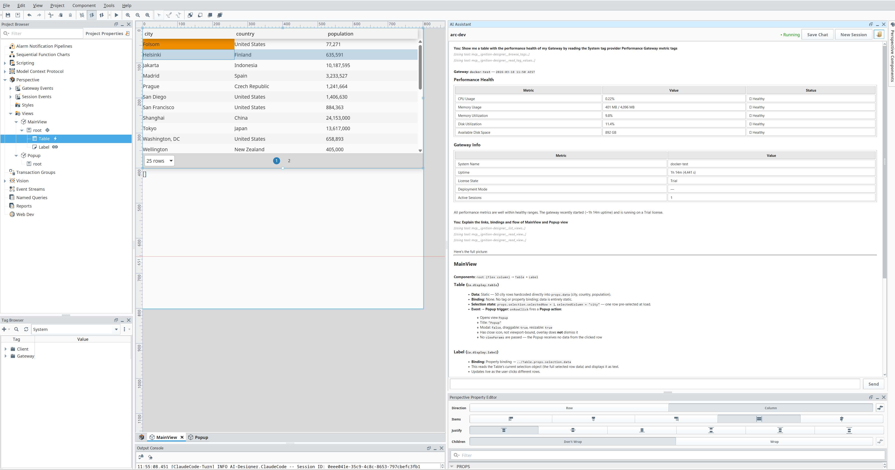
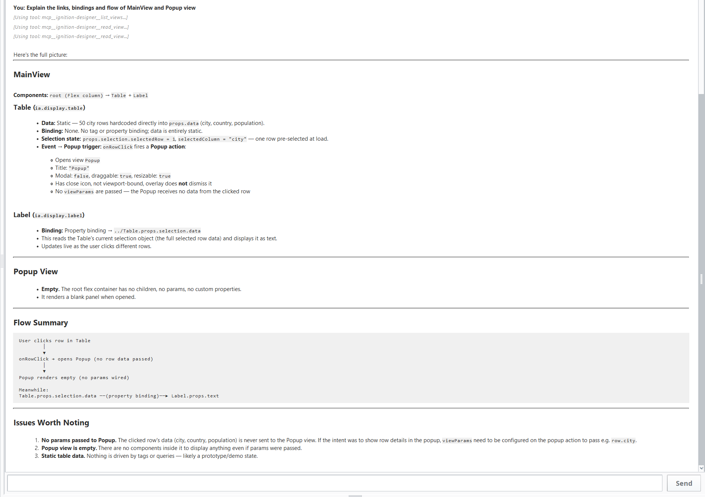
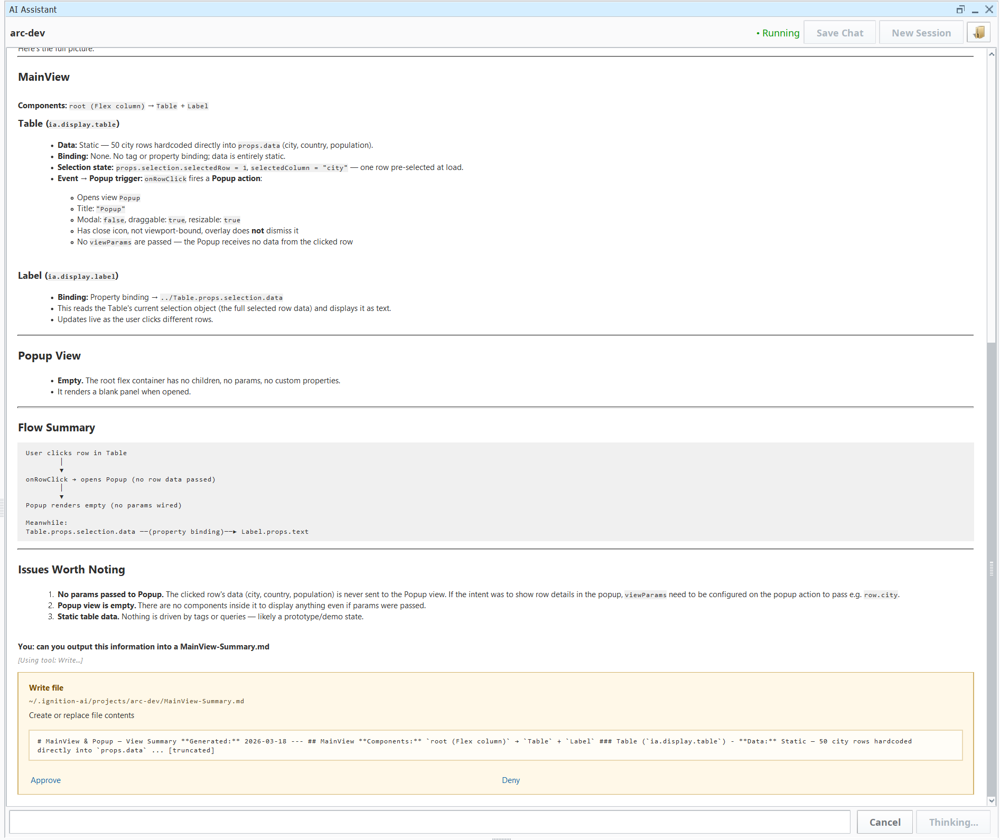

# Arc

Ignition SCADA module for integrating AI agent workflow into Ignition Designer.







## Getting Started

1. Install [Claude Code](https://docs.anthropic.com/en/docs/agents-and-tools/claude-code/overview) on your dev machine.
2. Grab the latest `.modl` from [releases](https://github.com/TaylorEdgerton/arc/releases).
3. Install through the Ignition Gateway.

## How It Works

Chat with Claude directly in the Designer. It connects through Designer over MCP and can read your project scripts, views, bindings, tag configuration — all without leaving the IDE.

Ask Claude to output or read from files in the project workspace, prompting permissions.

Save your chats for context across sessions, or bring your own skills and agents to build out a development setup that fits how you work.

Currently read-only.

## Skills & Agents

Arc bridges Claude Code into Designer, which means you get the full `.claude/` workspace structure. Drop files into your project workspace to extend what Claude can do:

```
~/.ignition-ai/projects/<project-name>/
├── CLAUDE.md                    # project context, auto-generated on first run
├── .claude/
│   ├── skills/                  # reusable instructions Claude can invoke
│   │   ├── ignition-scripting/
│   │   │   └── SKILL.md
│   │   ├── perspective-patterns/
│   │   │   └── SKILL.md
│   │   └── jython-scripting/
│   │       └── SKILL.md
│   └── agents/                  # specialised agents Claude can delegate to
│       ├── code-reviewer/
│       │   └── agent.md
│       └── alarm-auditor/
│           └── agent.md
```

**Skills** teach Claude how to do something — your Perspective component patterns, scripting conventions, naming standards, or how your historian schema works. Claude references these when they're relevant, or you invoke them directly with `/skill-name`.

**Agents** define a role with a specific goal — a code reviewer that checks your scripts against your style guide, an alarm auditor that inspects alarm pipelines, a binding checker that flags missing or broken bindings. Claude automatically delegates to agents when the task matches their description, or you reference them with `@agent-name`.

These are standard Claude Code features. You write them as plain markdown with YAML frontmatter. See the [Claude Code docs](https://docs.anthropic.com/en/docs/agents-and-tools/claude-code/overview) for the full spec.

## Requirements

- Ignition 8.3+
- Claude Code CLI
